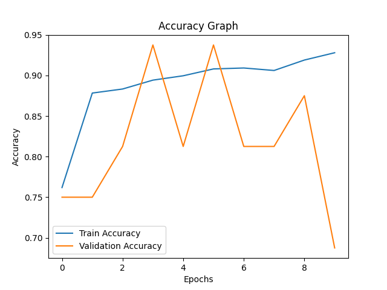
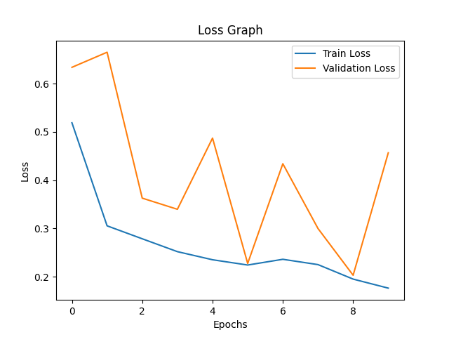
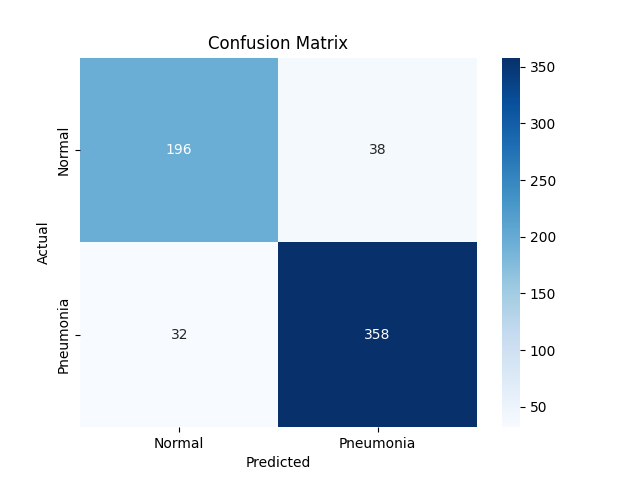

# 🩺 AI-Powered Medical Image Analysis

## 📌 Overview
This project uses Deep Learning techniques to detect Pneumonia from Chest X-ray images. It provides a complete pipeline including data preprocessing, model training, evaluation, and a Streamlit-based web application for real-time predictions.

## ❗ Problem Statement
Manual diagnosis of pneumonia from chest X-rays is time-consuming and prone to human error. This project leverages Artificial Intelligence to assist in faster and more accurate detection.

## 🚀 Features
- Upload chest X-ray images  
- Predict whether the image is Normal or Pneumonia  
- Display prediction confidence score  
- Interactive Streamlit web interface  
- Model performance visualization (Accuracy, Loss, Confusion Matrix)  
- Classification report generation  

## 🗂️ Project Structure
AI-Powered-Medical-Image-Analysis/
│
├── data/
│   └── chest_xray/
│       ├── train/
│       │   ├── NORMAL/
│       │   └── PNEUMONIA/
│       ├── val/
│       │   ├── NORMAL/
│       │   └── PNEUMONIA/
│       └── test/
│           ├── NORMAL/
│           └── PNEUMONIA/
│
├── model/
│   └── pneumonia_model.keras
│
├── outputs/
│   ├── accuracy.png
│   ├── loss.png
│   ├── confusion_matrix.png
│   └── report.txt
│
├── screenshots/
│   ├── streamlite_overview.png
│   ├── normal.png
│   └── pneunomia.png
│
├── src/
│   ├── train.py
│   ├── model.py
│   ├── preprocessing.py
│   └── predict.py
│
├── app.py
├── main.py
├── requirements.txt
├── README.md

## ⚙️ Tech Stack
Python, TensorFlow, Keras, OpenCV, Streamlit, NumPy, Pandas, Matplotlib, Seaborn

## 📊 Model Performance

### Accuracy Graph

### Loss Graph

### Confusion Matrix

## 📄 Classification Report
precision    recall  f1-score   support

Normal       0.86      0.84      0.85       234  
Pneumonia    0.90      0.92      0.91       390  

accuracy                           0.89       624  
macro avg       0.88      0.88      0.88       624  
weighted avg    0.89      0.89      0.89       624  

## 🖥️ Application Screenshots

### Home Page

### Normal Prediction

### Pneumonia Prediction

## ▶️ How to Run the Project

Clone the repository:
git clone https://github.com/your-username/AI-Powered-Medical-Image-Analysis.git
cd AI-Powered-Medical-Image-Analysis

Create virtual environment (optional):
python -m venv venv
venv\Scripts\activate

Install dependencies:
pip install -r requirements.txt

Train the model:
python -m src.train

Run the application:
streamlit run app.py

## 🔮 Future Improvements
- Integrate Grad-CAM heatmaps for model explainability  
- Improve model accuracy using Transfer Learning (ResNet, EfficientNet)  
- Deploy application on cloud platforms (Streamlit Cloud / AWS / Azure)  
- Add multi-class disease detection (e.g., Tuberculosis, COVID-19)  
- Optimize model performance for real-time inference on low-end devices  
- Implement user authentication and patient record storage  
- Enhance UI/UX for better user experience  

## ⚠️ Disclaimer
This project is for educational purposes only and should not replace professional medical diagnosis.

## 👩‍💻 Author
Swetha K